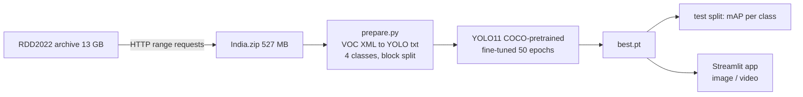

# Road Hazard Detection

Finds **potholes and road cracks** in road images and dashcam / helmet-cam
video, using a YOLO11 detector fine-tuned on **7,706 real Indian road images**
(RDD2022, India subset).

**Live demo: https://vivekvagale.github.io/road-hazard/** : runs in your
browser (ONNX + WebAssembly, 10 MB). Flip through the sample roads, paste a
photo (Ctrl+V), drag and drop a photo or video, or open it on a phone and point
the camera at a road. **Save** downloads the marked-up photo with a branded
footer listing what was found.

Fixing one training mistake (early stopping on a noisy validation set) raised
mAP@0.5 from 0.267 to 0.386, a 44% gain, with no model change. A 3.6x bigger
model (YOLO11s) did **not** do better: the limit here is data, not model size.

## Results (held-out test split, 775 images)

| Model | Params | mAP@0.5 | mAP@0.5:0.95 | Pothole AP@0.5 | Alligator crack | Longitudinal crack | Transverse crack | Inference |
|---|---|---|---|---|---|---|---|---|
| YOLO11n, first run (stopped early at epoch 40) | 2.6M | 0.267 | 0.106 | 0.323 | 0.534 | 0.195 | 0.016 | 3.0 ms/img (RTX 4060) |
| **YOLO11n, 50 epochs (live demo)** | 2.6M | **0.386** | **0.164** | **0.429** | **0.673** | **0.308** | **0.133** | 2.9 ms/img (RTX 4060) |
| YOLO11s, checkpoint picked on validation (epoch 32) | 9.4M | 0.299 | 0.133 | 0.293 | 0.591 | 0.249 | 0.065 | 5.9 ms/img (RTX 4060) |
| YOLO11s, final epoch 50 * | 9.4M | 0.379 | 0.175 | 0.370 | 0.661 | 0.356 | 0.128 | 5.9 ms/img (RTX 4060) |
| YOLO11n, final epoch 50 * | 2.6M | 0.392 | 0.167 | 0.438 | 0.693 | 0.304 | 0.133 | 2.9 ms/img (RTX 4060) |

\* Final-epoch rows were scored on the test set *after* the "best" checkpoints,
to investigate why YOLO11s looked worse. Picking a checkpoint by its test score
would be test-set peeking, so both are shown. What they show: with only 775
validation images, validation mAP is too noisy to pick checkpoints (YOLO11s's
"best" epoch 32 scores 0.30 on test, its final epoch 0.38), the same problem that
broke early stopping. The fix is a larger validation set or k-fold validation.

## Run it

```powershell
uv venv --python 3.11 .venv
.venv\Scripts\activate
uv pip install torch torchvision --index-url https://download.pytorch.org/whl/cu126
uv pip install -r requirements.txt

python -m src.download                          # India.zip only (527 MB of the 13 GB archive), resumable
python -m src.prepare                           # VOC XML -> YOLO labels, block split 80/10/10
python -m src.train --model yolo11n.pt          # ~50 min on an RTX 4060
python -m src.train --model yolo11s.pt
streamlit run app.py                            # test images, uploads, or a video clip
python -m src.export_web                        # ONNX for the browser demo in web/
python -m pytest
```

## How it works



- **Classes:** D00 longitudinal crack, D10 transverse crack, D20 alligator crack, D40 pothole.
- **Block split:** frames come from continuous drives, so neighbouring images
  show the same damage. Images are split in blocks of 25 consecutive frames,
  so near-duplicates cannot sit in both train and test.
- **Images with no damage are kept** (58% of the data) so the model learns what a normal road looks like.

The browser demo (`web/index.html`) re-implements YOLO's pre- and
post-processing in JavaScript: letterbox resize to 640, then decode the
[1, 8, 8400] output (box + 4 class scores per candidate) and non-maximum
suppression. It matches the Python predictions on the same image.

Design decisions and trade-offs: [docs/INTERVIEW_NOTES.md](docs/INTERVIEW_NOTES.md).

## Limits

- No bike-mounted footage yet: RDD India was shot from a car. The viewpoint
  from a motorcycle is lower and shakier.
- Speed breakers and debris are not in RDD.
- Transverse cracks have only 57 training boxes; that class is unreliable.

## Data

Arya, D., Maeda, H., Ghosh, S. K., Toshniwal, D., & Sekimoto, Y. (2022).
*RDD2022: A multi-national image dataset for automatic road damage detection.*
figshare, CC BY 4.0. Downloaded by the code, not redistributed here.

## Author

**Vivek Vagale** - [@VivekVagale](https://github.com/VivekVagale)
